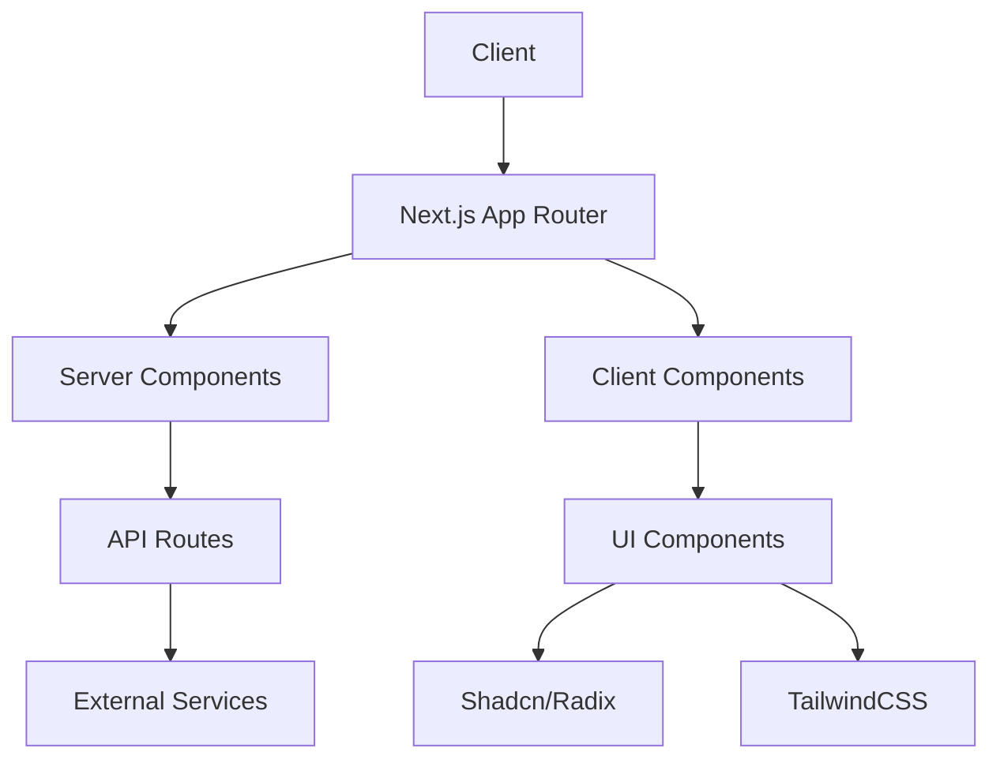
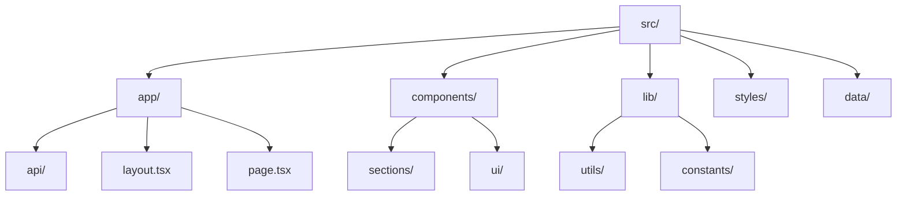
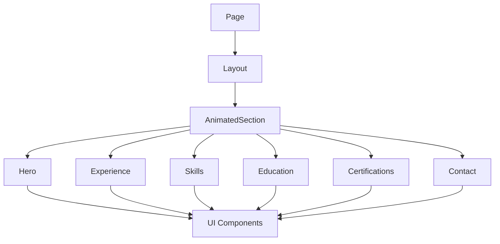

# Personal Portfolio Website

A modern, responsive portfolio website built with Next.js 14, TypeScript, and Tailwind CSS. This portfolio showcases professional experience, skills, and projects with a focus on performance, accessibility, and modern design principles.

## 🌟 Features

- Server-Side Rendering with Next.js 14
- Type-safe development with TypeScript
- Responsive design with Tailwind CSS
- Modern UI components with Shadcn UI
- Animated sections and transitions
- Contact form with email integration
- Mobile-first approach
- Accessibility focused
- Performance optimized

## 🏗️ Architecture



## 📁 Project Structure



## 🚀 Getting Started

### Prerequisites

- Node.js 18.x or higher
- pnpm package manager

### Installation

1. Clone the repository
```bash
git clone https://github.com/shahshrey/resume-app
```

2. Install dependencies
```bash
pnpm install
```

3. Set up environment variables
```bash
cp .env.example .env.local
```

4. Start the development server
```bash
pnpm dev
```

## 🛠️ Tech Stack

- **Framework**: Next.js 14
- **Language**: TypeScript
- **Styling**: Tailwind CSS
- **UI Components**: Shadcn UI / Radix UI
- **State Management**: React Context
- **Form Handling**: React Hook Form
- **Animations**: Framer Motion
- **Linting**: ESLint
- **Formatting**: Prettier
- **Git Hooks**: Husky
- **Deployment**: Vercel

## 📦 Component Structure



## 🔧 Configuration Files

- `tsconfig.json`: TypeScript configuration
- `tailwind.config.js`: Tailwind CSS configuration
- `postcss.config.js`: PostCSS plugins configuration
- `.eslintrc.json`: ESLint rules
- `.prettierrc`: Prettier formatting rules
- `commitlint.config.js`: Commit message linting rules

## 📱 Responsive Design

The portfolio follows a mobile-first approach with responsive breakpoints:

- Mobile: < 640px
- Tablet: 640px - 1024px
- Desktop: > 1024px

## ♿ Accessibility

- ARIA labels and roles
- Keyboard navigation
- Focus management
- Color contrast compliance
- Screen reader optimization

## ⚡ Performance Optimization

- Server Components
- Image optimization
- Lazy loading
- Code splitting
- Font optimization
- Asset minification

## 🔐 Security

- Input sanitization
- Environment variables
- API route protection
- Content Security Policy
- XSS prevention

## 📄 License

This project is licensed under the MIT License - see the LICENSE file for details.

## 🤝 Contributing

1. Fork the repository
2. Create your feature branch (`git checkout -b feature/amazing-feature`)
3. Commit your changes (`git commit -m 'feat: Add amazing feature'`)
4. Push to the branch (`git push origin feature/amazing-feature`)
5. Open a Pull Request

## 📞 Contact

For any questions or concerns, please open an issue or reach out through the contact form on the website. 